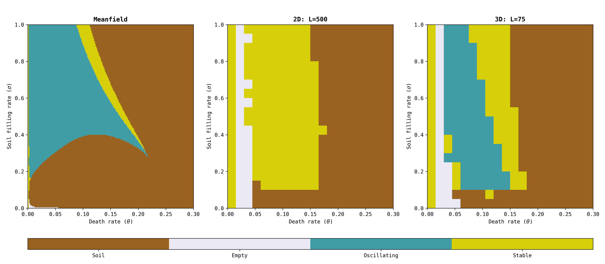

# Self-Organised .....Soil (??)

 
Riz Fernando Noronha

Supervised by Kim Sneppen and Kunihiko Kaneko

---

- Soil particle-sizes follow a power-law

- There is a correlation between the fractal dimension and the biodiversity of the soil

- *Hypothesis:* Biology contributes to the fractal structure

</img>
<a href="https://acsess.onlinelibrary.wiley.com/doi/abs/10.2136/sssaj1989.03615995005300040001x">Tyler and Wheatcraft, 1989</a>

---

### Parameters

- $\sigma$: Soil filling rate
- $\theta$: Death rate of worms
- $\mu$: Nutrient generation rate
- $\rho$: Reproductive rate of worms

 

> *One is a great number!*

---

### Algorithm

</img>

</img>

---

- Worm create nutrients *in their vicinity*

- Mutual co-existence

- Can be thought of as a predator-prey, as the worms consume soil in a 2-step process

---

### Survival in lattice vs Meanfield

---

### Parasite Problem

- Add a second species, and make it asymmetric in terms of:
  - $\mu$, nutrient generation rate
  - $\rho$, reproductive rate
 
- $\mu=0$ is a *parasite*.
- In mean-field, **the species with higher $\mu$ wins**.

---

<iframe width="auto" height="1000px" src="https://rizfn.github.io/Self-Organized-Soil/visualizations/twospec_samenutrient_lattice.html"style="border: 1px solid #ccc" frameborder=0>
</iframe>

---

### Multiple Species

<video src="images/feb29/4spec.mp4" style="max-width: 100%;" autoplay muted loop></video>

<video src="images/feb29/5spec.mp4" style="max-width: 100%;" autoplay muted loop></video>

---

Literature suggests **spiral waves**...

</img>
 <a href="https://pubmed.ncbi.nlm.nih.gov/14604183/">Takeuchi and Hogweg, 2012</a> 

---

#### Why no Spirals?

- Assume we have a magical wave source.

- Waves ejected in the right order

- Soil needed for nutrient generation, and so waves **cannot propagate**!

</img>
</img>

---

##### After removing soil

<video src="images/feb29/nosoil_4spec.mp4" style="max-width: 100%;" autoplay muted loop></video>

<video src="images/feb29/nosoil_5spec.mp4" style="max-width: 100%;" autoplay muted loop></video>

---

### Spatial confinement

 

- Assuming you're surrounded by soil, how do you propagate into it?

- *All species* must be present on the expansion boundary

- Expansion is **hard**!

---

<video src="images/feb29/4spec_boundary.mp4" style="max-width: 100%;" autoplay muted loop></video>

<video src="images/feb29/5spec_boundary.mp4" style="max-width: 100%;" autoplay muted loop></video>

---

### Power Laws

- For certain parameter values, we do see power-law distributed "particle sizes".

- More work is necessary to draw conclusions.

